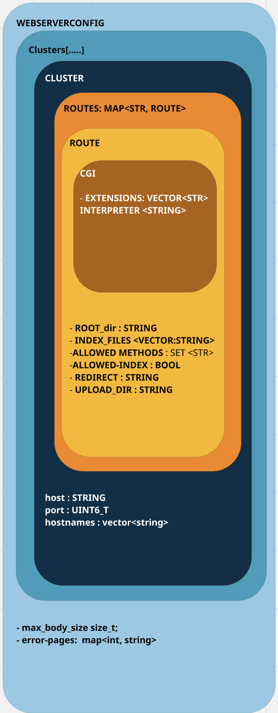

# Webserv – 42 Project

This project is focused on implementing a scalable and non-blocking HTTP server from scratch using C++98. The goal is to understand and implement the internals of a web server including networking, request parsing, routing, response generation, and serving static and dynamic content. The server is evaluated based on correctness, performance, and compliance with HTTP standards.


# Team Members

-> Nabil [GitHub](https://github.com/NabilHY)
-> Simo L2asad [GitHub](https://github.com/Mohammed-Benjaddi)
-> Bunda [GitHub](https://github.com/SaladBunda)

---

## 🌐 Project Overview

The **Webserv** project requires writing a fully-functional HTTP/1.1 server in C++98 that supports core web server functionality. Your server must be able to:

- Handle multiple client connections simultaneously (epoll, poll, or select)
- Parse HTTP requests and generate valid responses
- Serve static content (HTML, CSS, JS, etc.)
- Support file uploads via `POST` requests
- Allow clients to delete files via `DELETE` requests
- Route requests based on configuration rules
- Execute CGI programs (e.g., PHP or Python scripts)
- Support directory listing, redirects, and custom error pages

The project mimics behavior found in NGINX and other production-grade web servers.

---

## 🗺️ Initial Configuration Model

  Server is Virtual Hosting capable, allowing multiple server instances to run on the same machine, each with its own configuration. The configuration is defined in a `config.toml` file, which specifies global settings, error pages, and individual server blocks.

  ### Explanation of `config.toml`

  This `config.toml` file is used to configure a server with global settings, error pages, and multiple server instances, each with specific routes and behaviors.

  ---

  ## Global Settings
  ```toml
  [global]
  max_body_size = 104857600
  ```
  - `max_body_size`: Sets the maximum allowed size for request bodies (in bytes). This limits the size of file uploads and other request bodies to prevent abuse.

  ```toml
    [default_error_pages]
    400 = "/errors/400.html"
    403 = "/errors/403.html"
    404 = "/errors/404.html"
    500 = "/errors/500.html"
    503 = "/errors/503.html"
  ```
  - `default_error_pages`: Maps HTTP status codes to custom error pages. When a specific error occurs, the server will serve the corresponding HTML file.

  ### Explanation of Server Blocks in `config.toml`

  Each `[[servers]]` block in the `config.toml` file represents a virtual server instance. These blocks allow you to define multiple servers, each with its own configuration, such as host, port, routes, and behavior. This is useful for virtual hosting, where multiple websites or services are hosted on the same physical server.

---

  #### Structure of a Server Block
  ```toml [[servers]]
  host = "0.0.0.0"
  port = [8080, 8081]
  hostnames = ["example.com", "www.example.com"]
  ```
  [[servers]]: Declares a new server block.
  host: Specifies the IP address the server listens on. 0.0.0.0 binds to all available network interfaces.
  port: A list of ports the server listens on (e.g., 8080, 8081).
  hostnames: A list of domain names the server responds to (e.g., example.com, www.example.com).

#### Routes in a Server Block
```toml [[servers.routes]]
  path = "/"
  root = "/html"
  index = ["index.html"]
  methods = ["GET", "POST"]
  autoindex = true
  ```
  [[servers.routes]]: Declares a new route for the server.
  path: The URL path this route applies to (e.g., /).
  root: The filesystem path where files for this route are served from (e.g., /www/).
  index: A list of default files to serve when the path is accessed (e.g., index.html).
  methods: A list of allowed HTTP methods for this route (e.g., GET, POST).
  autoindex: Whether to enable directory listing if no index file is found (true/false).


#### Classes Defined in `config.toml`
`WebServerConfig`: Top-level object representing the full server config.
  
`max_body_size`: Limits upload body size.

`error_pages`: Maps HTTP status codes to custom error files.

`Clusters`: Represent virtual hosts listening on a host,port pair.

`host, port, and hostnames[]` - Define virtual server identity.

`routes`: Map paths (e.g., /upload, /admin) to Route objects.

`Route`: Configuration per path prefix.

`root_dir`: Filesystem path where the route is served from.

`index_files`: Default files like index.html, index.php.

`allowed_methods`: Allowed HTTP methods (GET, POST, DELETE).

`allowed_index`: Whether directory listing is enabled.

`redirect`: Optional redirect target.

`upload_dir`: Target directory for POST uploads.

`CGI`: Defines execution rules for scripts.

`extensions`: Which file extensions trigger CGI.

`interpreter`: Path to the interpreter (e.g., /usr/bin/php-cgi).




---

## 🧠 Server Structure

The server is modular and layered:

- **Multiplexer**  
  Manages multiple client sockets using `epoll` (or `poll`/`select` on MacOS). It handles read/write readiness and disconnection detection.

- **Connection**  
  Represents each client session, with non-blocking I/O, buffering, and state management.

- **Request Parser**  
  Decodes HTTP headers, method, path, and body from the read buffer.

- **Router / Config Loader**  
  Maps request paths to server blocks and location blocks defined in the configuration file.

- **Response Generator**  
  Forms proper HTTP responses including status codes, headers, and body. Supports autoindex, file serving, uploads, and deletions.

- **CGI Handler**  
  Executes scripts based on file extension and parses their output into HTTP responses.

---

## 🛠️ Configuration File

Webserv uses an NGINX-inspired configuration format.

Each `server` block allows you to specify:

- Ports and host IPs to bind to
- Server names (virtual hosting)
- Error pages
- Maximum body size
- Routes (`location`) with:
  - Accepted methods (`GET`, `POST`, `DELETE`)
  - Upload directories
  - Redirects
  - Root paths
  - Autoindex
  - Default index files
  - CGI handling

---

## Running the Server

### To Run in a Container:

#### In Docker Compose:

```bash
docker-compose up 
docker exec webserv ./webserv config_file.conf
```
```
Make sure to expose the ports you want to use in the `docker-compose.yml` file.

### To Run Locally:
```git clone https://github.com/NabilHY/webserve-42.git

cd webserv-42

make

./webserv config_file.conf
```
Make sure that the port numbers arent already in use.


## 🧪 Testing
To test the server, you can use tools like `curl` or Postman to send HTTP requests to the server. 

## 📚 Resources

[HTTP RFC] (https://datatracker.ietf.org/doc/html/rfc2616)


__Networking__
[what's the difference between processes, threads, and io multiplexing?](https://www.youtube.com/watch?v=85T_ZaT8EUI&t=10s)
- [Create a simple HTTP server in c](https://medium.com/from-the-scratch/http-server-what-do-you-need-to-know-to-build-a-simple-http-server-from-scratch-d1ef8945e4fa)
- [(Video) Create a simple web server in c](https://www.youtube.com/watch?v=esXw4bdaZkc&ab_channel=JacobSorber)
- [(Video) explaining select()](https://www.youtube.com/watch?v=Y6pFtgRdUts&ab_channel=JacobSorber)
- [IBM - Nonblocking I/O and select()](https://www.ibm.com/support/knowledgecenter/ssw_ibm_i_72/rzab6/xnonblock.htm)
- [All about sockets blocking](http://dwise1.net/pgm/sockets/blocking.html)
- [TCP Socket Programming: HTTP](https://w3.cs.jmu.edu/kirkpams/OpenCSF/Books/csf/html/TCPSockets.html)
- [Beej's Guide to Network Programming](https://beej.us/guide/bgnet/)
- [Design Multithreaded web server in C++(Socket programming)](https://www.udemy.com/course/design-multithreaded-http-web-server/)

__HTTP__
- [MDN - HTTP](https://developer.mozilla.org/en-US/docs/Web/HTTP)
- [An Overview of the HTTP as Coverd in RFCs](https://www.inspirisys.com/HTTP_Protocol_as_covered_in_RFCs-An_Overview.pdf)
- [How the web works: HTTP and CGI explained](https://www.garshol.priv.no/download/text/http-tut.html)
- [MIME](https://developer.mozilla.org/en-US/docs/Web/HTTP/Basics_of_HTTP/MIME_types)
- [HTTP Status Codes](https://umbraco.com/knowledge-base/http-status-codes/)

__RFC__
- [How to Read an RFC](https://www.tutorialspoint.com/cplusplus/cpp_web_programming.htm)
- [RFC 9110 - HTTP Semantics ](https://www.rfc-editor.org/info/rfc9110)
- [RFC 9112 - HTTP/1.1 ](https://www.rfc-editor.org/info/rfc9112) 
- [RFC 2068 - ABNF](https://www.cs.columbia.edu/sip/syntax/rfc2068.html) 
- [RFC 3986 -  (URI) Generic Syntax](https://www.ietf.org/rfc/rfc3986)
- [RFC 6265 - HTTP State Management Mechanism (Cookies)](https://www.rfc-editor.org/rfc/rfc6265)
- [RFC 3875 - CGI](https://datatracker.ietf.org/doc/html/rfc3875)


